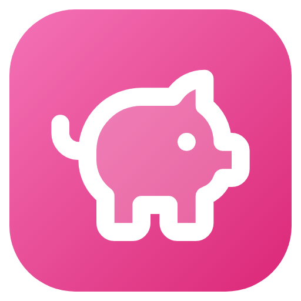

# Chanchito



App de escritorio para Windows para llevar tus finanzas personales mes a mes, pensada para Argentina:

- Gastos con categorías, medios de pago y gastos recurrentes que se cargan solos.
- Tarjetas de crédito bien resueltas: el gasto cuenta en el mes en que pagás el resumen, según el día de cierre.
- Compras en cuotas proyectadas a futuro y lo que tenés comprometido por tarjeta.
- Ahorros en pesos y en dólares (compra y venta de USD) con metas y cuánto ahorrar por mes.
- Reporte anual y exportación a Excel y CSV.
- 100% local y privada: sin cuentas, sin login, tus datos quedan en tu PC, con backups automáticos.

## Descarga

Gratis. El instalador para Windows sale de GitHub Actions (artifact `chanchito-instalador` del último build).
Próximamente en Microsoft Store.

[Política de privacidad](https://tobiasheynen.github.io/app-finanzas-escritorio/privacidad.html): la app no
recolecta ningún dato.

## Desarrollo

```bash
npm ci
npm run dev       # app en modo desarrollo
npm test          # tests unitarios
npm run package   # instalador NSIS (en Windows)
npm run package:store  # paquete .appx para Microsoft Store (en Windows)
```

Más detalle técnico en [CLAUDE.md](CLAUDE.md).

## Licencia

[PolyForm Noncommercial 1.0.0](LICENSE.md): podés usarla, ver el código, modificarlo y compartirlo **sin fines
comerciales**. No está permitido venderla ni usarla para ganar plata. © 2026 Tobias Heynen.
